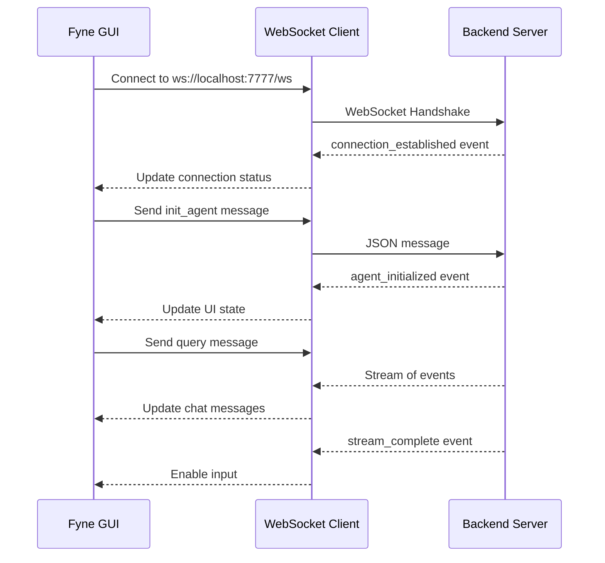

# Fyne GUI Frontend Implementation Plan

## Overview

This plan outlines the implementation of a Fyne-based GUI frontend in Go to replace the existing JavaScript/Next.js frontend for the Water AI application.

## Current Architecture Analysis

### Existing Frontend Features (Next.js/React)
The current JavaScript frontend provides:

1. **Chat Interface**
   - Message history display with user/assistant messages
   - Question input with file upload support
   - Message editing capabilities
   - Loading states and animations

2. **Tabbed Panel System**
   - **Browser Tab**: Displays web browser screenshots and search results
   - **Code Tab**: Code editor with syntax highlighting
   - **Terminal Tab**: Terminal emulation with xterm.js

3. **WebSocket Communication**
   - Real-time bidirectional communication with backend
   - Event types: `init_agent`, `query`, `cancel`, `edit_query`, etc.

4. **Settings Management**
   - Model selection
   - API key configuration
   - Tool settings

5. **Session Management**
   - Session persistence
   - Session sharing via URL

## Proposed Fyne Architecture

### Directory Structure

```
cmd/water-gui/
├── main.go              # Application entry point
├── app.go               # Fyne app initialization
├── ui/
│   ├── main_window.go   # Main window layout
│   ├── chat/
│   │   ├── chat_view.go       # Chat message list
│   │   ├── message_item.go    # Individual message widget
│   │   └── input_area.go      # Question input with file upload
│   ├── panels/
│   │   ├── browser_panel.go   # Browser screenshot display
│   │   ├── code_panel.go      # Code viewer/editor
│   │   └── terminal_panel.go  # Terminal output display
│   ├── settings/
│   │   └── settings_dialog.go # Settings configuration
│   └── components/
│       ├── connection_status.go
│       └── sidebar.go
├── client/
│   ├── websocket_client.go    # WebSocket connection handling
│   ├── event_handler.go       # Event processing
│   └── models.go              # Data models
└── resources/
    ├── icons/
    └── fonts/
```

### Core Components

#### 1. Main Window Layout

```
┌─────────────────────────────────────────────────────────────┐
│  Water AI Logo    [Window Title]           [Settings] [X]   │
├─────────────────────────────────────────────────────────────┤
│                                                             │
│  ┌─────────────────────┐  ┌───────────────────────────────┐ │
│  │                     │  │ [Browser] [Code] [Terminal]   │ │
│  │    Chat Messages    │  ├───────────────────────────────┤ │
│  │                     │  │                               │ │
│  │                     │  │     Panel Content             │ │
│  │                     │  │     (Browser/Code/Terminal)   │ │
│  │                     │  │                               │ │
│  ├─────────────────────┤  │                               │ │
│  │ [Input Area]        │  │                               │ │
│  │ [Attach] [Send]     │  │                               │ │
│  └─────────────────────┘  └───────────────────────────────┘ │
│                                                             │
├─────────────────────────────────────────────────────────────┤
│  Connection Status: Connected ●                             │
└─────────────────────────────────────────────────────────────┘
```

#### 2. WebSocket Client



#### 3. Data Models

```go
// Message represents a chat message
type Message struct {
    ID        string
    Role      string  // user, assistant, system
    Content   string
    Timestamp int64
    IsHidden  bool
}

// WebSocketMessage represents a WebSocket message
type WebSocketMessage struct {
    Type    string          `json:"type"`
    Content json.RawMessage `json:"content"`
}

// AppState holds the application state
type AppState struct {
    Messages           []Message
    CurrentQuestion    string
    IsLoading          bool
    IsConnected        bool
    SelectedModel      string
    ActiveTab          TabType
    BrowserURL         string
    BrowserScreenshot  []byte
    CodeContent        string
    TerminalOutput     string
}
```

### Implementation Details

#### Phase 1: Core Infrastructure

1. **Add Fyne Dependency**
   ```bash
   go get fyne.io/fyne/v2
   ```

2. **Create Basic Window Structure**
   - Main window with split pane layout
   - Left panel: Chat interface
   - Right panel: Tabbed view for Browser/Code/Terminal

3. **WebSocket Client Implementation**
   - Reuse existing `gorilla/websocket` dependency
   - Implement event-driven message handling
   - Thread-safe state updates for GUI

#### Phase 2: Chat Interface

1. **Message List**
   - Scrollable list of message widgets
   - Different styling for user/assistant messages
   - Support for markdown rendering (basic)

2. **Input Area**
   - Multi-line text entry
   - File attachment button
   - Send button with loading state
   - Keyboard shortcuts (Enter to send, Shift+Enter for newline)

#### Phase 3: Panel Views

1. **Browser Panel**
   - Image display for screenshots
   - URL display
   - Basic navigation controls

2. **Code Panel**
   - Syntax-highlighted code display
   - File tree navigation
   - Read-only mode for safety

3. **Terminal Panel**
   - Text output display
   - ANSI color code support
   - Auto-scroll functionality

#### Phase 4: Settings & Polish

1. **Settings Dialog**
   - Model selection dropdown
   - API key input fields
   - Tool configuration options

2. **Connection Status**
   - Visual indicator in status bar
   - Reconnection logic

3. **Theming**
   - Dark theme matching existing frontend
   - Custom colors for branding

### Dependencies to Add

```go
require (
    fyne.io/fyne/v2 v2.4.3
)
```

### Build Considerations

1. **Cross-Platform Builds**
   - Windows: Requires MinGW for compilation
   - macOS: Requires Xcode command line tools
   - Linux: Requires GTK3 development libraries

2. **Makefile Updates**
   ```makefile
   .PHONY: gui
   gui:
       go build -o bin/water-gui ./cmd/water-gui
   
   .PHONY: gui-release
   gui-release:
       fyne package -os windows -icon resources/icon.png
       fyne package -os darwin -icon resources/icon.png
       fyne package -os linux -icon resources/icon.png
   ```

### Migration Strategy

1. **Parallel Development**
   - Keep existing Next.js frontend unchanged
   - Fyne GUI is a separate entry point under `cmd/water-gui/`

2. **Shared Backend**
   - Both frontends connect to the same Go backend server
   - No backend changes required

3. **Feature Parity**
   - Implement core features first
   - Advanced features (VS Code integration, Google Drive) can be added later

### Testing Strategy

1. **Unit Tests**
   - WebSocket client logic
   - State management
   - Event handling

2. **Integration Tests**
   - End-to-end communication with backend
   - UI responsiveness under load

3. **Manual Testing**
   - Cross-platform UI verification
   - Performance testing with large messages

## Implementation Order

1. Create `gui` branch
2. Add Fyne dependency
3. Create basic window structure
4. Implement WebSocket client
5. Build chat interface
6. Add panel views
7. Implement settings
8. Polish and test
9. Push to `gui` branch

## Notes

- Fyne uses a declarative UI approach with widgets
- All UI updates must happen on the main goroutine using `fyne.CurrentApp().SendNotification()` or similar
- The existing `gorilla/websocket` dependency can be reused
- Consider using `fyne.io/fyne/v2/widget` for rich text rendering in chat messages
